# To beginning with 
I have been doing this challenge following the instructions provided from: https://grafana.com/tutorials/grafana-fundamentals.

## First, setup
I had to setup a sample application, so I started with clone github.com/grafana/tutorial-environment repository,

then started the sample application.

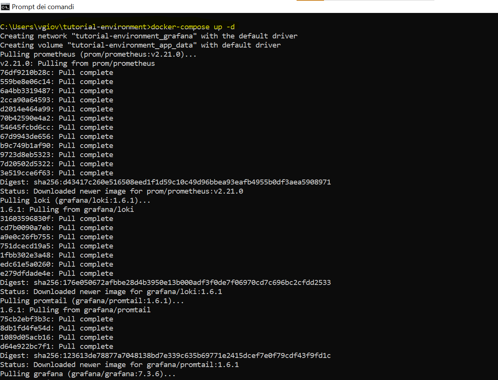

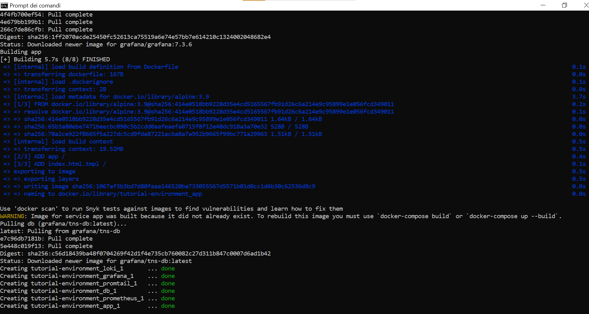

I made sure the docker was working,

I Ensured all services are up-and-running also the application (desktop).

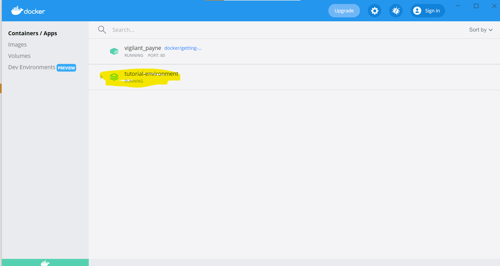

Lastly tried to the sample application on http://localhost:8081/,

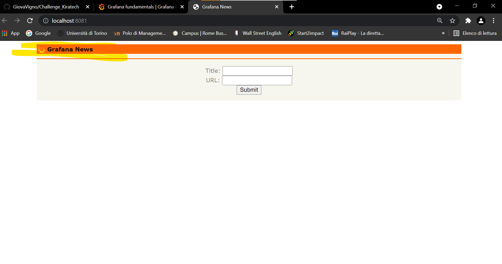
I added a like and voted it.
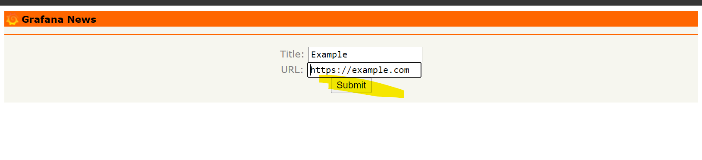
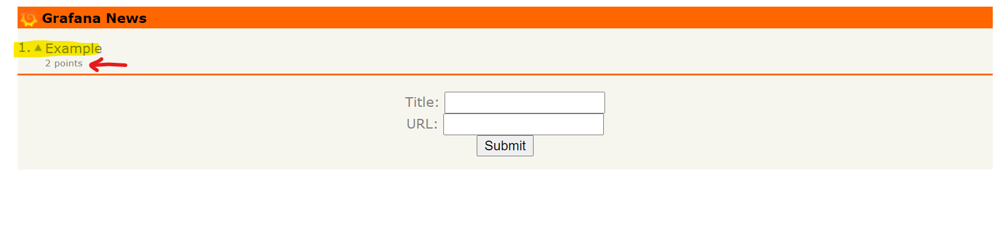

## Second, Log in to Granafa 
I checked into docker and browsed to http://localhost:3000/,

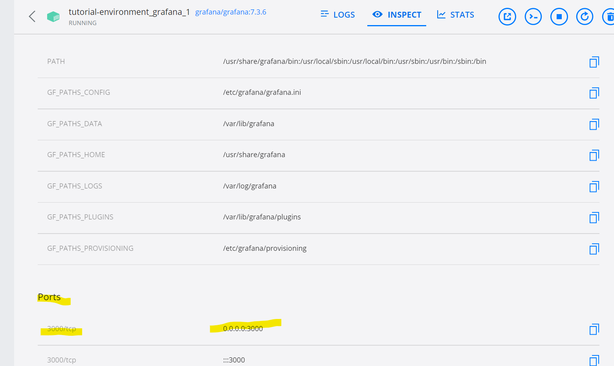
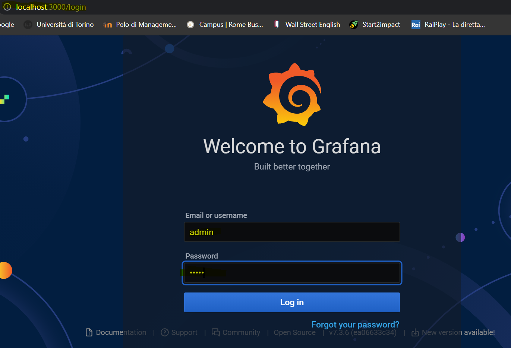

consequently I entered inside,

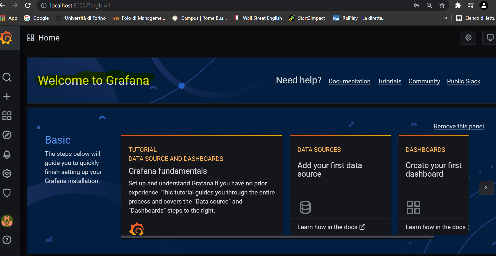

## Third, metrics and data source

I visualized the metrics from Prometheus , however I needed to add it as a data source (into the corfiguration) in Grafana.

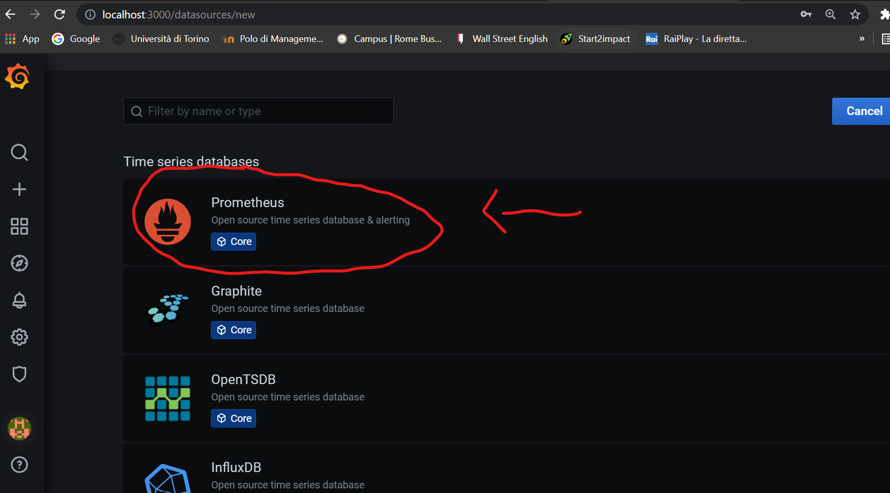

After a few simple steps, I had to fill up the boxs.Then saved and tested.

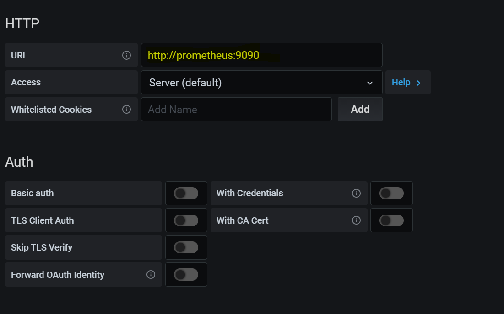
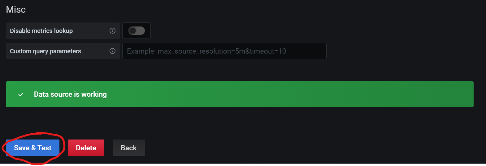

## Forth, explore metrics 
I uses Explore to create speficif queries to understand the metrics exposed. By the way in the side bar,I clicked the **Explore** bottom and in the **Query editor** wrote close the **Metrics** bottom, and change the time picker. 

.png)

Hence, I Added the **rate** function to the query to visualize the rate of requests per second, and I saw the legend below the graph.

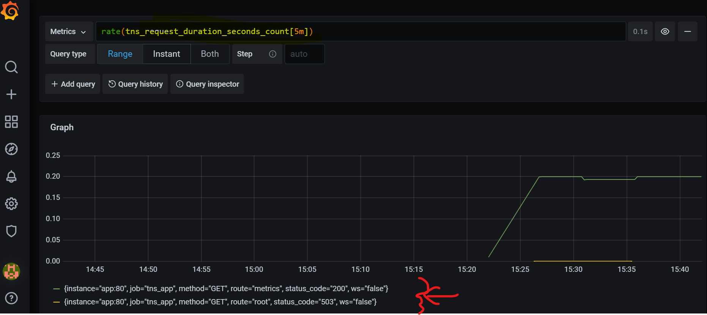

Moreover I Added the **sum** function to the query to group time series by route,

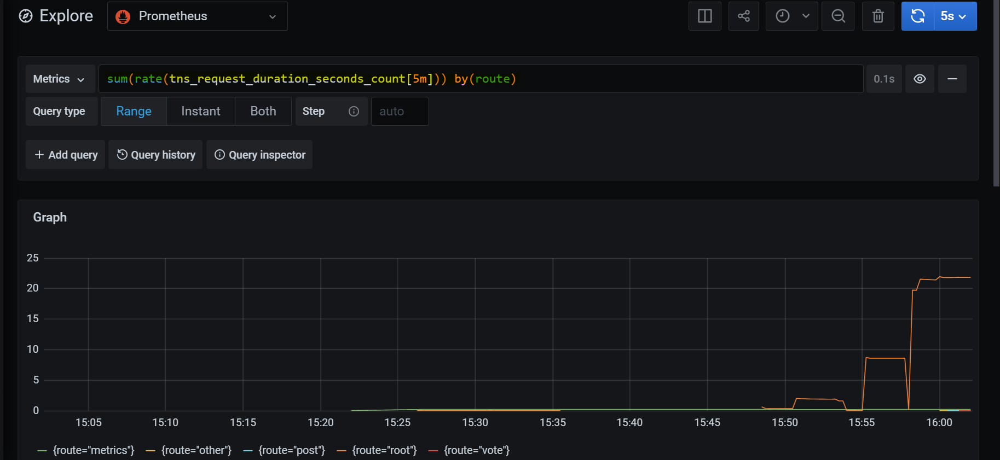

I went back to the http://localhost:8081/ and generated some traffic, and I checked what happened in the last 5 minutes.

After that I tried to change the **group by** with another label like status_code and istance .

## Fifth, logging data source

I needed to add data source **Loki** to Grafana. Always in the configuration like earlier, but into the url box I filled up with http://loki:3100/.

## Sixth, Explore logs

In order to explore the logs, I had to use **Loki** date source. Thus In the **Query editor**, I entered,

and it displayed all logs within the log file of the sample application.

