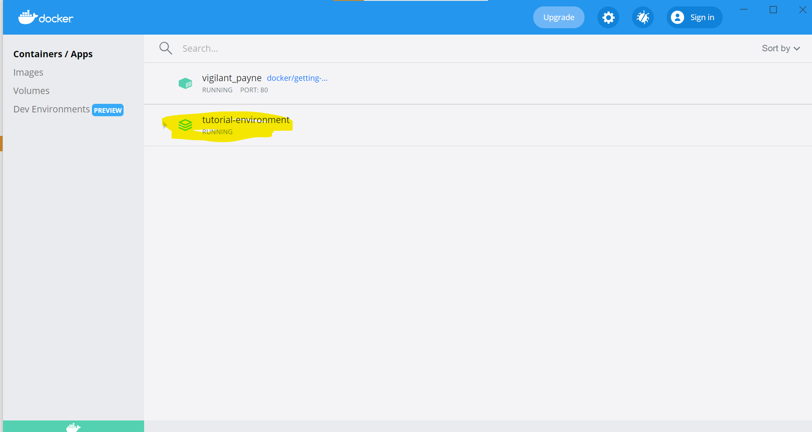
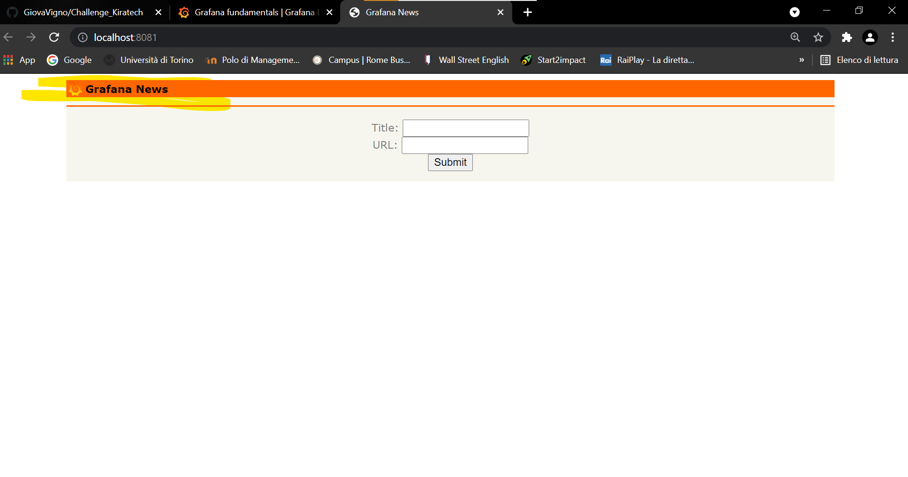
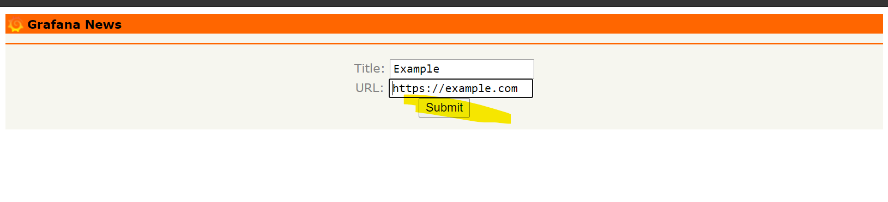
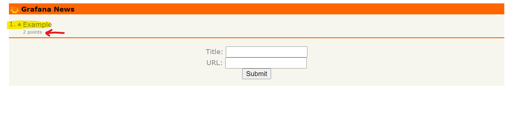

# To beginning with 
I have been doing this challenge following the instructions provided from: https://grafana.com/tutorials/grafana-fundamentals.

## First, setup
I had to setup a sample application, so I started with clone github.com/grafana/tutorial-environment repository,

then started the sample application.

I made sure the docker was working,

I Ensured all services are up-and-running also the application (desktop).

Lastly tried to the sample application on http://localhost:8081/,

I added a like and voted it.

## Second, Log in to Granafa 
I browsed to http://localhost:3000/ 

