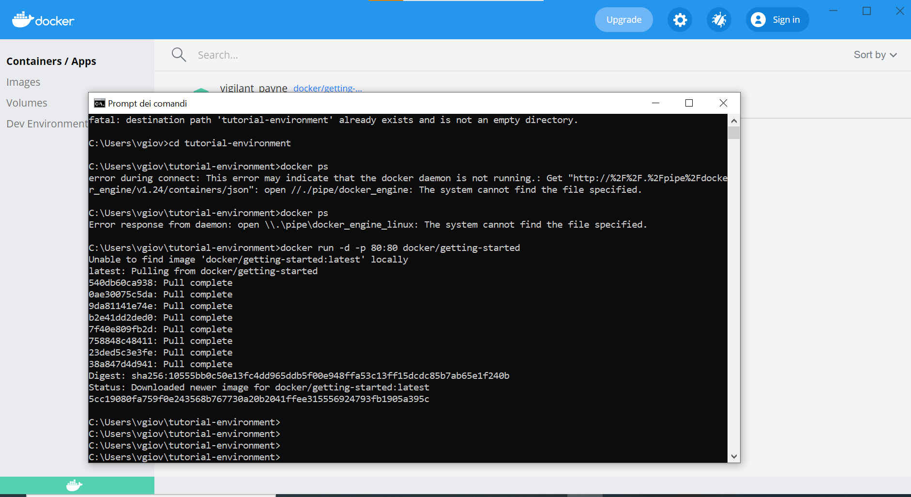
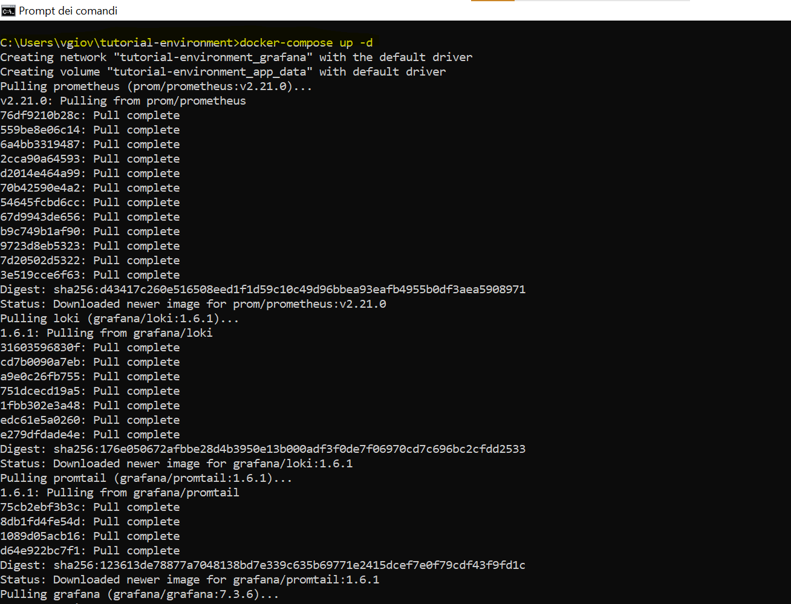
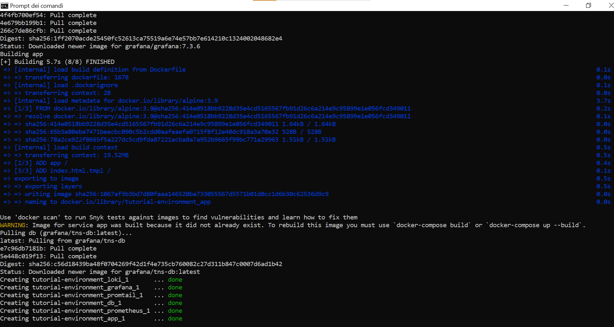
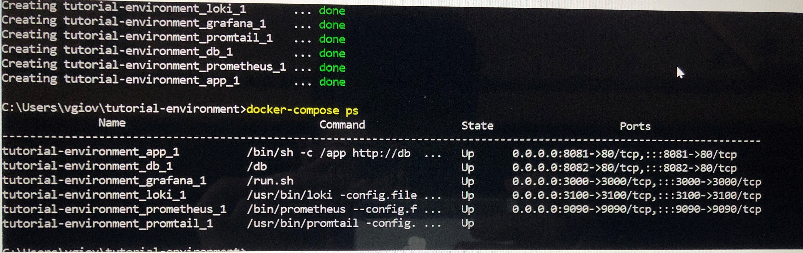

# To beginning with 
I have been doing this challenge following the instructions provided from: https://grafana.com/tutorials/grafana-fundamentals.

## First step
I had to setup a sample application, so I started with clone github.com/grafana/tutorial-environment repository,

then started the sample application.

I made sure the docker is working on,

